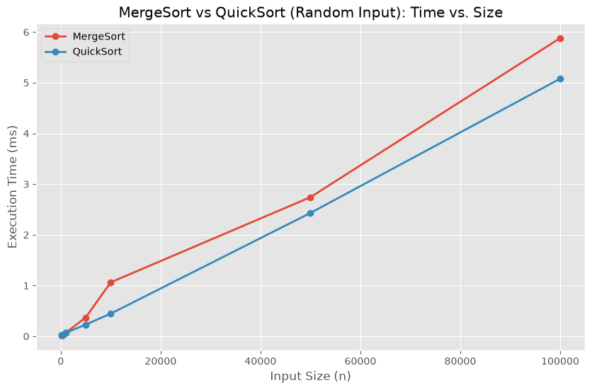
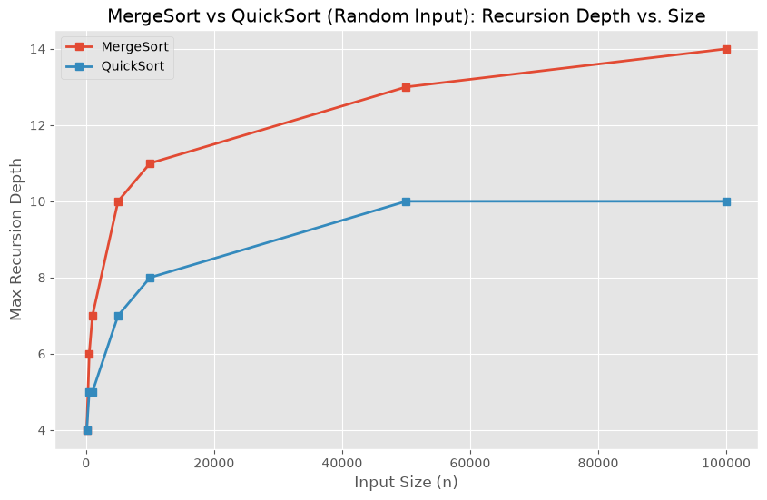
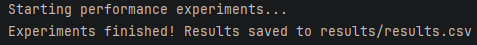
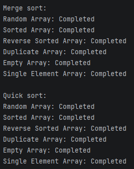
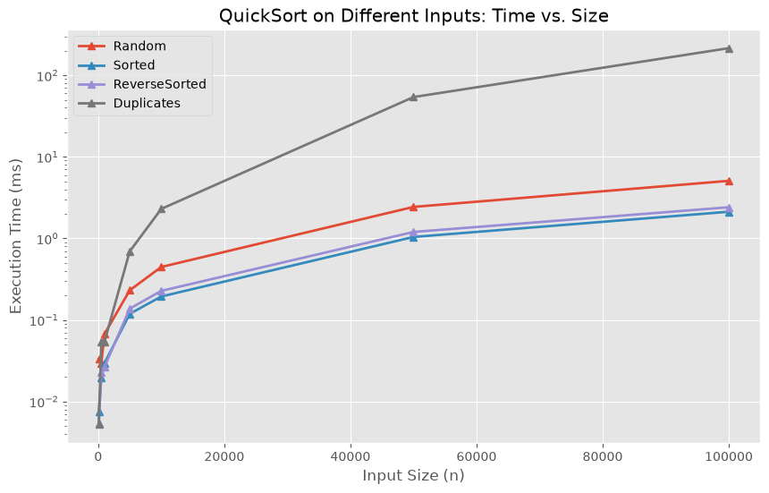
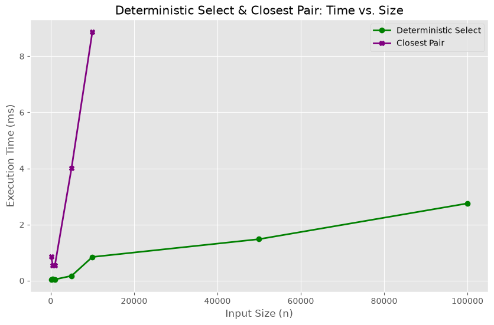

# Assignment 1: Divide and Conquer Algorithms Analysis

## A. Project Overview
**Purpose of the assignment:** This project aims to bridge theoretical computer science concepts with practical software engineering by implementing and benchmarking Divide and Conquer algorithms. The goal is to evaluate empirical performance against theoretical time and space complexities.

**Implemented algorithms:**
1. MergeSort
2. QuickSort
3. Deterministic Selection (Median of Medians)
4. Closest Pair of Points

    ---

## B. Algorithm Analysis

### 1. MergeSort
* **How it works:** Recursively divides the array into two halves until each subarray has one element, then merges the sorted subarrays back together.
* **Time Complexity:** Worst/Average/Best case is $O(n \log n)$. 
* **Space Complexity:** $O(n)$ due to the auxiliary array required for the merge step.
* **Recurrence Analysis:** $T(n) = 2T(n/2) + O(n)$. According to the Master Theorem (Case 2, where $a=2, b=2, d=1, P=0$), $f(n) = \Theta(n^dlog^{P+1}n)$, leading to $T(n) = \Theta(n \log n)$.

### 2. QuickSort
* **How it works:** Selects a pivot, partitions the array into elements less than and greater than the pivot, and recursively sorts the partitions.
* **Time Complexity:** Average case $O(n \log n)$, Worst case $O(n^2)$.
* **Space Complexity:** $O(\log n)$ average recursion stack depth (worst case $O(n)$ without tail-call optimization).
* **Recurrence Analysis:**
  * Average: $T(n) = 2T(n/2) + O(n) \implies O(n \log n)$.
  * Worst (unbalanced split): $T(n) = T(n-1) + O(n)$. By expanding the recurrence, this forms an arithmetic progression summing to $O(n^2)$.

### 3. Deterministic Selection
* **How it works:** Finds the $k$-th smallest element by dividing the array into groups of 5, finding the median of each group, and recursively finding the "median of medians" to use as a high-quality pivot for partitioning.
* **Time Complexity:** Guaranteed $O(n)$.
* **Space Complexity:** $O(\log n)$ for the recursion stack.
* **Recurrence Analysis:** $T(n) \le T(n/5) + T(7n/10) + O(n)$. Using the Akra-Bazzi method, since the sum of the fractions $1/5 + 7/10 = 9/10 < 1$, the recurrence resolves to $O(n)$.

### 4. Closest Pair of Points
* **How it works:** Sorts points by x-coordinate, recursively halves the plane, finds the minimum distance in both halves, and then checks a middle "strip" for any cross-boundary closer pairs.
* **Time Complexity:** $O(n \log n)$.
* **Space Complexity:** $O(n)$ to store points and recursive copies.
* **Recurrence Analysis:** The divide step and recursive calls take $2T(n/2)$. The merge step (strip filtering) takes $O(n)$. The recurrence is $T(n) = 2T(n/2) + O(n)$. By the Master Theorem, this equals $O(n \log n)$.

---
---

## C. Experimental Results

Performance experiments were run across multiple input sizes ($n=100$ to $n=100,000$) and data types (Random, Sorted, ReverseSorted, Duplicates). The raw data including execution-time tables and recursion-depth results are recorded in `results/results.csv`.

**1. Time and Input Size (n)**

**2. Recursion Depth and Input Size (n)**

*(See section F for additional plots demonstrating performance across different input types).*

---

## D. Discussion

* **Do the results match theoretical complexity?**
  Yes. Both MergeSort and QuickSort show nonlinear $O(n \log n)$ scaling on random inputs. Deterministic Selection exhibits the expected linear $O(n)$ growth, confirming the theory.
* **How does input structure affect performance?**
  Input structure heavily impacts QuickSort. On sorted or reverse-sorted data, a naive pivot choice degrades performance. Duplicates can also cause excessive redundant swaps depending on the partitioning scheme. MergeSort is structurally immune to input variance, maintaining consistent times.
* **Why does smaller-first recursion help QuickSort?**
  By always recursively sorting the smaller partition first, the maximum depth of the recursion stack is bounded to $O(\log n)$. This prevents StackOverflow errors in worst-case scenarios where the array is heavily unbalanced.
* **Why does Median-of-Medians guarantee $O(n)$?**
  It mathematically guarantees that the chosen pivot eliminates at least 30% of the array in every recursive step. This transforms the unpredictable $T(n) = T(n-1) + O(n)$ worst-case of QuickSelect into a strictly decaying $T(n) \le T(n/5) + T(7n/10) + O(n)$.
* **Why is divide-and-conquer Closest Pair faster than $O(n^2)$ for large inputs?**
  A naive approach compares every point to every other point ($n(n-1)/2$ comparisons). The divide-and-conquer approach uses a geometric proof showing that within the combining "strip", any given point needs to be compared to at most 7 other points. This reduces the merge step to $O(n)$, dropping overall complexity to $O(n \log n)$.
* **What practical factors affect performance?**
  Empirical results are influenced by the JVM setup. JIT (Just-In-Time) compilation can speed up hot loops during later test runs. MergeSort generates heavy object allocation, triggering Garbage Collection (GC) pauses. QuickSort is faster in practice because it operates in-place, taking advantage of CPU cache locality.

---

## E. Reflection

Implementing these algorithms bridged the gap between abstract computer science theory and practical software engineering. 

The main implementation challenge was handling edge cases—particularly ensuring robust partitioning in QuickSort for duplicate elements and properly managing the 
y-coordinate sorting within the Closest Pair strip. Visualizing the execution data highlighted the real-world impact of these algorithmic design choices, reinforcing the importance of algorithmic efficiency and optimal data structures for high-performance systems.

---

## F. Screenshots

### Program Output

### Test Results

### Additional Plots
**QuickSort Performance by Input Type:**

**Searching Algorithms (Select & Closest Pair):**

